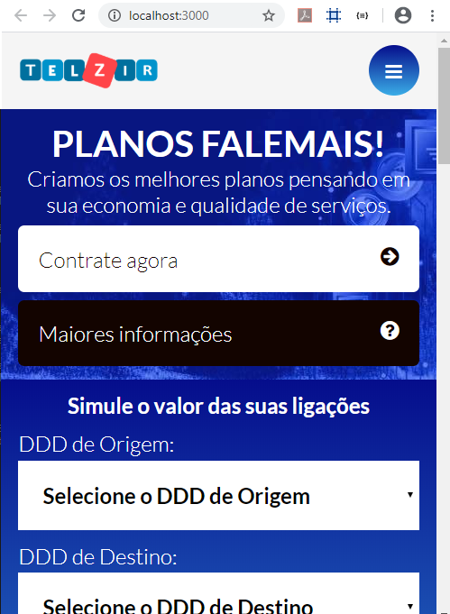

# TELZIR - Simulador de pagamento para planos telefônicos (desenvolvido com javascript - React Hooks e Typescript)

O projeto de Front foi criado com o auxílio do [Create React App](https://pt-br.reactjs.org/docs/create-a-new-react-app.html), fazendo uso de [React Hooks](https://pt-br.reactjs.org/docs/hooks-intro.html) em conjunto com [Typescript](https://www.typescriptlang.org/index.html).

A implementação também engloba internacionalização (suporte para en-US e pt-BR de acordo com a linguagem do browser), bem como, testes de código, responsividade (para visualização em celulares e tablets diferenciada) e componentização.

Observação: Somente foi realizada a codificação do formulário que realiza a simulação, demais elementos em tela somente foram adicionados para compor o layout e dar mais expressão para a responsividade, entretanto, nenhuma ação foi implementada para os mesmos.

Os seguintes componentes foram desenvolvidos:

> - alert >
Elemento quer irá exibir uma mensagem na validação dos campos requeridos.

> - article >
Apresenta notícias diversas em uma estrutura representada por uma imagem e um texto.

> - button >
Apresenta parametrizações de apresentação e permite injetar a ação que será executada ao clicar.

> - comboBox >
Apresenta uma listagem de elementos fornecida externamente com algumas opções de configuração.

> - footer >
Apresenta icones que representam links para diversas redes sociais para utilização no rodapé da página.

> - input >
Campo que permite a definição do type (ex. número ou texto), da informação que será inserida no mesmo.

> - menu >
Componente que recebe uma listagem com os itens do menu e os renderiza de acordo.

> - simmulateResult >
Elemento quer irá representar o resultado do cálculo da simulação, proporcionando para o usuário o comparativo dos valores.


Por padrão, o sistema irá executar localmente na seguinte url: http://localhost:3000), sendo:

**Tela principal do sistema:**


**Resultado da simulação:**


**Tela em resoluções menores:**



## Instalação para desenvolvimento (ambiente e execução)

Necessários o seguinte para a correta execução:

- Instalação do Node.js, [clique aqui para as instruções](https://nodejs.org/en/download/)

- Após instalado, abrir um console e digitar:

  * Instalar as dependencias do projeto com: `npm install`
  * Executar o projeto `npm run start`
  Após isto, o mesmo poderá ser observado na seguinte url [`localhost:3000`](http://localhost:3000) no browser correspondente (homologação realizada para as versões recentes do Chrome, Opera, Firefox e Edge).

## Execução dos testes

Considerando que o ambiente já esteja configurado conforme instruções anteriores, digite o seguinte em um console do projeto:

```shell
npm run test
```

Será executado o script de testes do projeto (testes dos componentes individuais e teste do fluxo principal de simulação). 

Os testes fazem uso de mock, não sendo necessário a disponibilidade do backend ou base de dados para a execução dos mesmos.

Um relatório html com detalhes da execução pode ser observado na pasta "coverage", na raiz do projeto.
